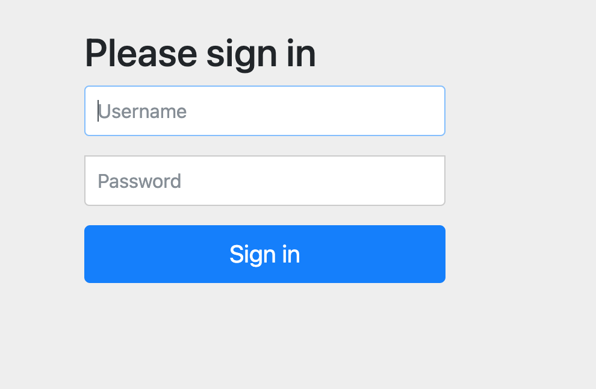

# Minnaker

```console
curl -L https://github.com/armory/minnaker/archive/v0.1.3.tar.gz | tar -zxv
```

```console
$ spin_endpoint
```

And tehe ouptut:
```console
https://3.95.63.227
username: 'admin'
password: '/yPR59fA5IMQVQFo/BhOvLs1MIRbl7TmMmPiL9NSpMiGyBPZ'
```

# Login with credentials




