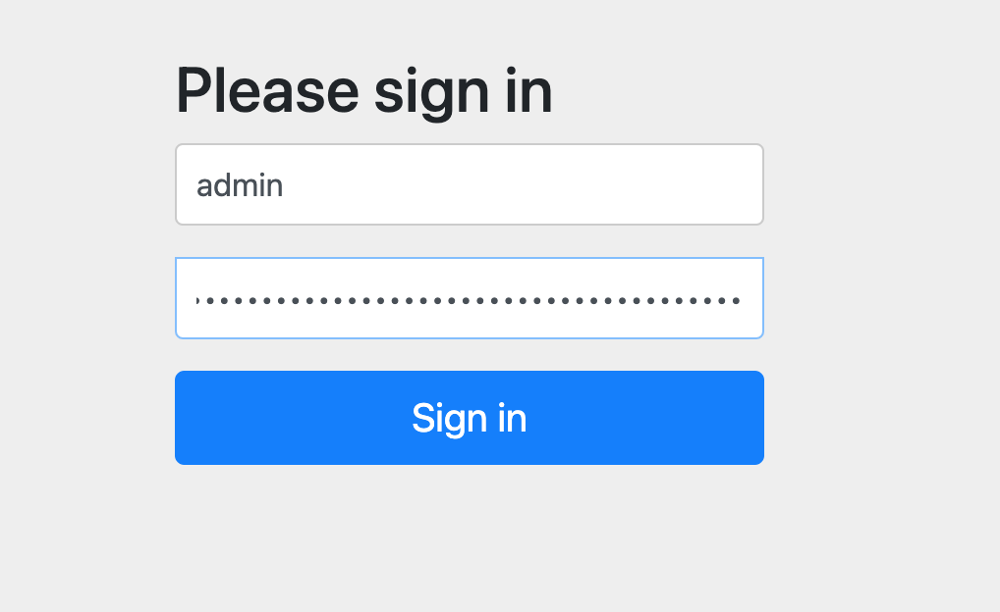

# Minnaker Install


## Step 1:  Login to VM Node

You will ssh to your vm node

## Step 2: clone github

```bash
git clone https://www.github.com/armory/minnaker
```

Now we should change the branch

```bash
ln -s minnaker spinnaker
cd minnaker
git checkout tags/0.0.22
```


```console
https://3.95.63.227
username: 'admin'
password: '/yPR59fA5IMQVQFo/BhOvLs1MIRbl7TmMmPiL9NSpMiGyBPZ'
```


## Step 3 Execute the install script

5. Execute the install script. Note the following options before running the script:
     * Add the `-o` flag if you want to install open source Spinnaker.
     * By default, the script installs Armory Spinnaker and uses your public IP address (determined by `curl`ing `ifconfig.co`) as the endpoint for Spinnaker.
     * For bare metal or a local VM, specify the IP address for your server with `-P` flag. `-P` is the 'Public Endpoint' and must be an address or DNS name you will use to access Spinnaker (an IP address reachable by your end users).

```bash
./scripts/install.sh
```


## Step 4: Get the Endpoint


```bash

spin_endpoint
```

You should get th reposne 

```console
https://54.91.142.169
username: 'admin'
password: 'v5fXi/tiHPsUqXhiENE+Q89esG3GBdJ/cFXmprx8mRINcH8t'
```
    

You can also get username like this:


```bash
grep override /etc/spinnaker/.hal/config
```

Use the first URL.

And you can get password like this:

```bash
cat /etc/spinnaker/.hal/.secret/spinnaker_password
```

## Step 5: Navigate to Spinnaker

In your browser, navigate to the IP_ADDR (https://IP/) for Spinnaker from step 1. This is Deck, the Spinnaker UI.

If you installed Minnaker on a local VM, you must access it from your local machine. If you deployed Minnaker in the cloud, such as an EC2 instance, you can access Spinnaker from any machine that has access to that 'Public IP'.

Log in to Deck with the following credentials:

    Username: `admin`

    Password: <Password from step 4>   

Access the Halyard pod and run `hal --version` to verify that Halyard has been updated.



